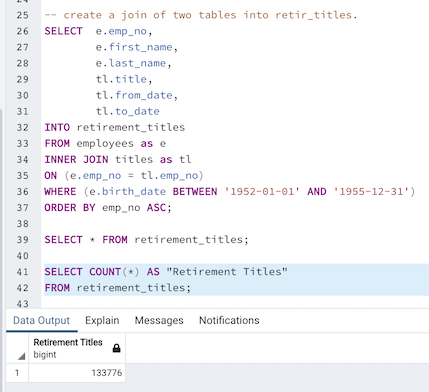
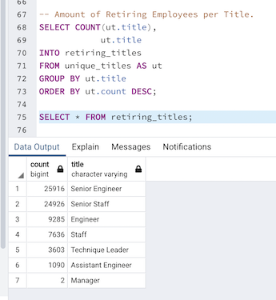

# Pewlett-Hackard-Analysis

## Project Overview

Pewlett Hackard is a large company with thousand of employees. This company is interested in upgrading from Excel and VBA analysis to SQL analysis to help them with the amount of data they have. As baby-boomers were starting to retire at a fast rate, the Human Resources department was concerned with the number of upcoming retiring employees, so they wanted to be prepared and find out who is going to be retiring in the next few years and how many positions would need to filled. The retiring group will have the opportunity to be part time mentors to pass along all the knowledge they have. 

## Results

### Total Amount of Current Employees

- The image bellow represent the total amount of employees that are currently working in the company which is 240,124.
In order to get to this amount it was necessary to filter the to_date column by '9999-01-01', which is the date used for when an employee is still working in the company.
This data can also be found on the Data folder as Pewlett-Hackard-Analysis/Data/total_current_employees.csv

### First Result of Retiring Employees

- The first result of the amount of retiring employees was achieved by filtering the employees by the birth date range between '1952-01-01' and '1955-12-31'. Which resulted in 133,776 employees representing 55.7% of the total amount of current employees.

### Final Amount of Retiring Employees

-  The further analysis of the last query, which included looking at the csv file with the resulted data led to the conclusion that the the data was having duplicate entries on the employee number (emp_no), which led then to understanding why that was happening. And the reason for that was that these duplicates entries were there because employees have changed roles throughout the years, so every time that happened a new entry was registered in the database. So in order to fix final result, the last query was modified to also add the filter on the to_date column, since that would bring back not only the current employees working for the company but also only the data entry from the job title that is still active.
The final result was 72,458 as can be seen bellow. 

This data can also be found on the Data folder as Pewlett-Hackard-Analysis/Data/unique_titles.csv

### Total Amount of Retiring Employees by Job Title

- After getting the total amount of employees, another table was created to separate the result by job title. That is very important in order to know if the company will have enough mentors per title. 
To obtain the following table, the COUNT and GROUP BY methods were applied on the title column, using the total amount of retiring employees as the reference. From the resulted table, Senior Engineer and Senior Staff were the job titles with the biggest amount of future openings.

This data can also be found on the Data folder as Pewlett-Hackard-Analysis/Data/retiring_titles.csv

### Total Amount of Employees Eligible for the Mentorship Program

- A select group was defined to be the eligible employees for the mentorship program and to be trained by the retiring group.
The amount shown below was achieved by joining three different tables, then the to_date column was filter by the date '9999-01-01' which represents employees that are still working for the company, and the birth_date column was filtered to display only the employees that were born between '1965-01-01' and '1965-12-31', which was the company's criteria of selection for the mentorship program. As the final result the number was 1,549.

This data can also be found on the Data folder as Pewlett-Hackard-Analysis/Data/mentorship_eligibility.csv

### Total Amount of Employees Eligible for Mentorship Program by Title

- Below we can see the amount of eligible employee split by their titles. Staff and Senior Engineer are the ones with highest amount of potential substitutes.  
The table was obtained by applying the COUNT  and GROUP BY methods on the title column, using the total amount of eligible employees for the mentorship program as the reference. 

This data can also be found on the Data folder as Pewlett-Hackard-Analysis/Data/mentor_elig_by_title.csv

### Average of Retiring per Eligible Employees by Title

- The image below shows the code used and table resulting from it. On this joined table, we can see the total amount of retiring employees per title, amount of mentorship eligible employees per title and the average of eligible mentors per retiring employees by each job title. There are two 'null' values on the Manager title row, the reason for that is: there aren't any eligible managers to be mentors.
This data can also be found on the Data folder as Pewlett-Hackard-Analysis/Data/retir_per_elig_by_title.csv

## Summary

- After querying and analyzing the data, it is possible to see that the total amount of employees currently working for the company is 240,124. And the huge amount of 72,458 employees are going to be retiring on the upcoming years, representing 30.2% of the total. 
- The amount of employees eligible for the mentorship program were only 1,549. Which means even if all of those eligible ones were to be trained to substitute the retiring ones, there will still not going to be enough employees to fill up the upcoming empty positions. 

- When analyzing the upcoming empty positions by job title, the results have shown that the proportion of the eligible vs the retiring employees varied a lot where none of them will have enough qualified employees to substitute the upcoming empty positions. In fact, Senior Engineer and Senior Staff are the positions with the least amount of people that are going to be qualified to substitute them. Where the ratio is 63 future retirees per each eligible Senior Engineer, and 84 per each Senior Staff. 

- Another point that the analysis shows is that there will not be any qualified Managers to take over the 2 upcoming positions.

- After querying and analyzing the results it was able to find out that the younger generation working in the company is in fact born in 1965, which eliminates the interesting option of expanding the current criteria of getting only people born in 1965 to add people even younger than that age to be eligible for mentorship. The following image shows the query to check if there were any current employees born after 1965:

- Now that the company knows the numbers and have a better idea of the proportion of the upcoming impact, in addition to the mentorship program, an option would be to start opening internship and trainee positions to hire and train new people before the impact takes place.

